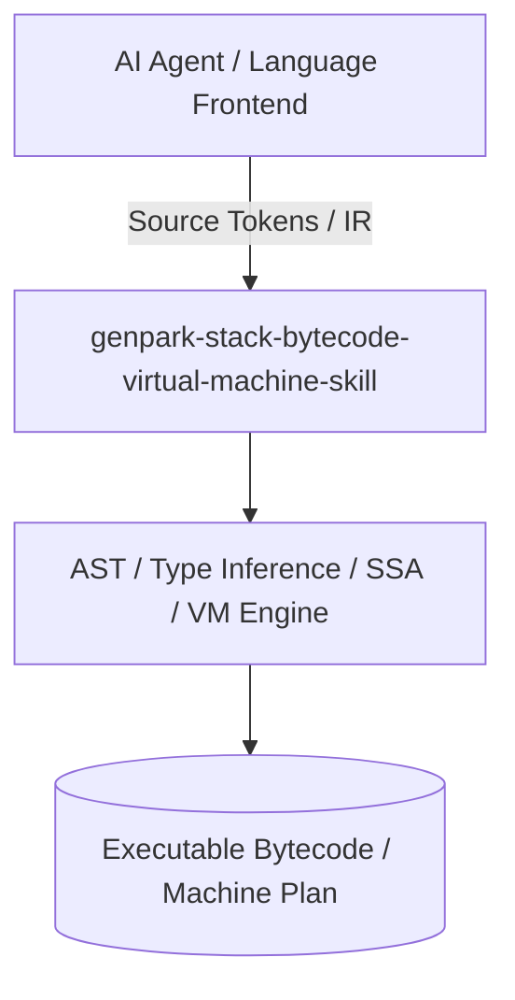

# genpark-stack-bytecode-virtual-machine-skill

[](https://github.com/alphaparkinc/genpark-stack-bytecode-virtual-machine-skill/actions)
[](https://opensource.org/licenses/MIT)
[](https://www.python.org/downloads/)

> Stack-based bytecode virtual machine interpreter supporting variable frame environments, arithmetic opcodes, and control flow dispatch.

## Architecture



## Features
- Pure standard library Python implementation with strictly zero pip dependencies.
- Production-grade compiler engineering principles (Pratt parsing, Algorithm W, ADCE, K-coloring).
- Native Model Context Protocol (MCP) server support for AI agent orchestration.

## Installation

```bash
git clone https://github.com/alphaparkinc/genpark-stack-bytecode-virtual-machine-skill.git
cd genpark-stack-bytecode-virtual-machine-skill
```

## Quickstart

```bash
python example_usage.py
```
